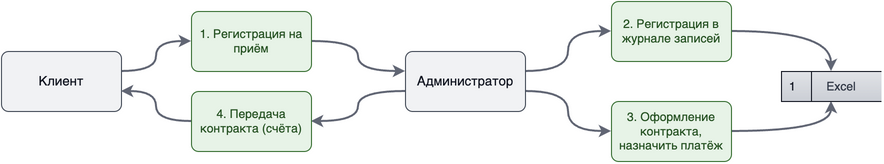
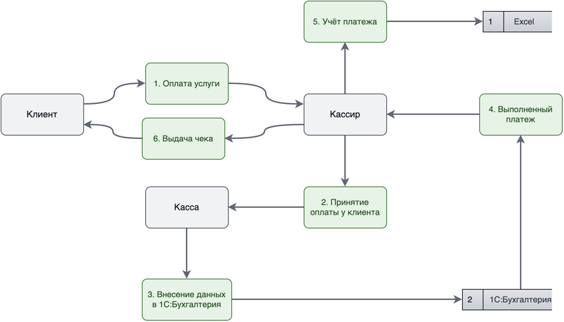
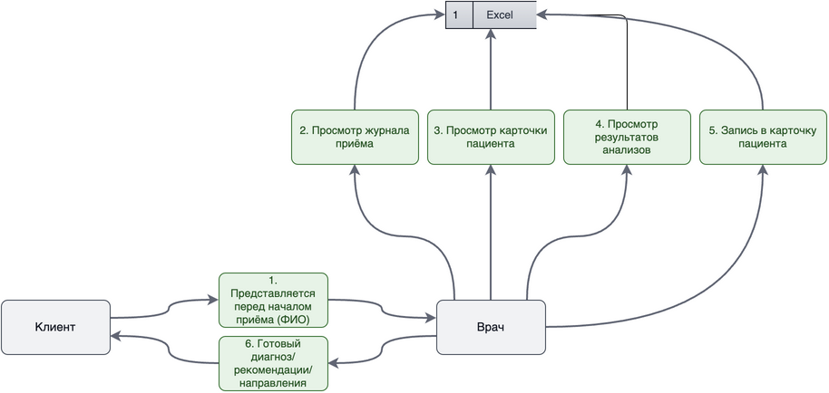
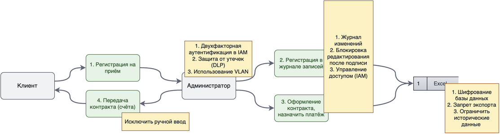
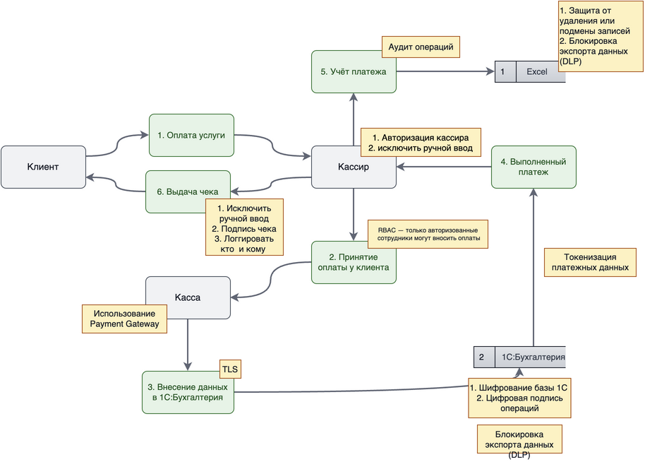
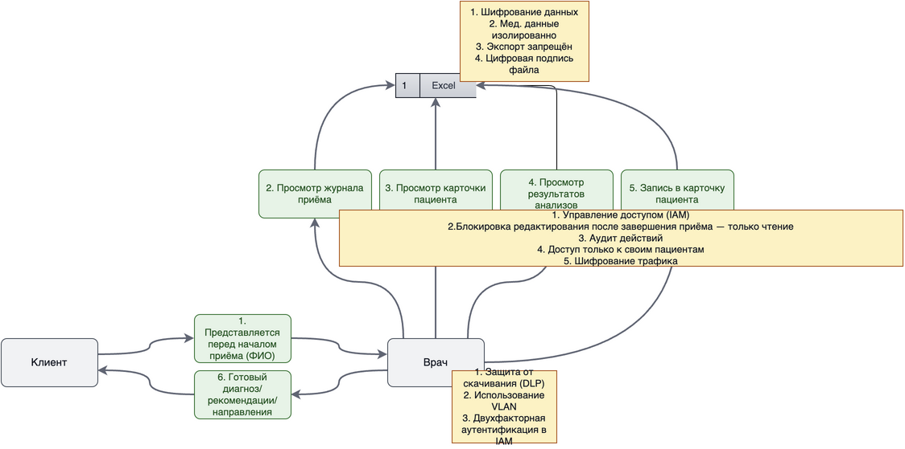

# Задание 1 — анализ данных и потоков (Medikamente)

Ниже — актуальные схемы «как есть» (as‑is), краткий аудит обращения с конфиденциальными данными и предложения к улучшению. Схемы обновлены и пересобраны в едином стиле.

## As‑Is: ключевые процессы и потоки

- Регистрация на приём:

- Оплата услуг:

- Приём у врача:

## Аудит мер безопасности (срез текущего состояния)

| Пункт проверки | Статус | Комментарий |
|---|---|---|
| Политика обработки ПДн | Нет | Документ не формализован и не доведён до сотрудников |
| Реестр операций с ПДн | Нет | Отсутствует учёт целей и правовых оснований |
| Согласия субъекта | Частично | На бумаге; цифровой учёт/отзыв не реализован |
| Шифрование при хранении (at rest) | Нет | Файлы Excel/PDF лежат в открытом виде |
| Шифрование при передаче (in transit) | Нет | Используются несекурные каналы внутри ЛВС |
| Аудит доступа/изменений | Нет | Нет централизованного журнала доступа к ПДн/медданным |
| Модели доступа (RBAC/ABAC) | Нет | Доступ фактически по доменной учётке к папкам |
| Обезличивание для аналитики | Нет | Аналитика ведётся на ПДн/медданных без маскирования |
| Резервное копирование | Неочевидно | Регламент и периодичность не зафиксированы |
| Инцидент‑реагирование | Нет | Нет регламента уведомления и расследования |
| Локализация хранения (РФ) | Выполняется | Серверы в офисе |
| Ограничение экспорта | Нет | Нет DLP/политик выгрузок |

## Выявленные проблемные зоны

См. подробный перечень: [Проблемы Безопасности.md](./Проблемы%20Безопасности.md)

Кратко: ручные процессы, неструктурированное хранение, отсутствие RBAC/ABAC и аудита, пересылка данных через почту без DLP, интеграции без контрактов и минимизации.

## Что предлагаем улучшить (фокус на Privacy by Design)

- Внедрить шифрование на покое/в каналах (KMS + TLS/mTLS), включить аудит доступа.
- Ввести модель доступа RBAC/ABAC по тегам чувствительности (PII/HEALTH/FINANCE).
- Регламентировать сбор и хранение: минимизация атрибутов и сроки удаления.
- Для аналитики — обезличивание/псевдонимизация, lineage и каталог данных.
- Интеграции — через API‑контракты с минимизацией полей и строгой валидацией.
- Почта и файлы — DLP‑правила и запрет нелегитимных рассылок чувствительных данных.

## To‑Be: модифицированные потоки

- Регистрация на приём (To‑Be):

- Оплата (To‑Be):

- Приём у врача (To‑Be):

