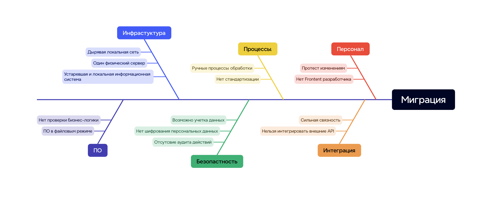

# Критические узкие места

# Рекомендации по устранению
## Инфраструктура
- Внедрить Kubernetes для оркестрации и стандартных релизных процедур
- Настроить регулярные резервные копии и тест восстановления (высокий приоритет)
- Навести порядок в ролях и группах AD для ЛВС; принцип «минимально необходимого доступа» (высокий приоритет)
- Развернуть CI/CD (build, тесты, security‑сканы, деплой)

## Программное обеспечение
- Перейти к микросервисной архитектуре там, где это снижает связанность и упрощает масштабирование
- Заменить Excel на нормализованную БД (PostgreSQL) и единые сервисы доступа к данным

## Персонал
- Нанять фронтенд‑разработчика (JS/React)
- Организовать обучение и подготовку к изменениям (процессы, инструменты)
- Собрать обратную связь по миграции и учесть риски
- Подготовить и донести план отката релизов

## Безопасность (высокий приоритет)
- Включить шифрование персональных и медицинских данных (at rest и in transit)
- Вести аудит всех действий с данными (доступ, изменения, выгрузки)
- Утвердить политику удаления ПДн (по запросу субъекта и срокам хранения)
- Ввести классификацию данных (PII/PHI/операционные) и тегирование чувствительных атрибутов
- Внедрить DLP‑систему для почты и файловых выгрузок

## Интеграции
- Стандартизировать интеграции через REST API/шлюз с контрактами и фильтрацией PII
- Включить валидацию схем, версионирование API и e2e‑логирование обмена

## Процессы
- Описать и поддерживать актуальные регламенты (SOP): сбор, хранение, доступ, удаление данных
- Для каждой роли зафиксировать минимально необходимый набор данных/доступов
- Автоматизировать запись пациентов и сопутствующие уведомления